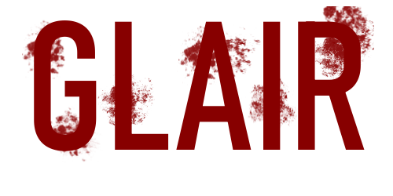

<div align="center">

#  

> *"In the depths of darkness, survival is not guaranteed..."*

[](https://godotengine.org/) [](https://godotengine.org/) [![Genre](https://img.shields.io/badge/Genre-Horror%20%7C%20Survival-ff0000?style=for-the-badge&logo=data:image/png;base64,iVBORw0KGgoAAAANSUhEUgAAAGsAAAC3CAYAAAAVQ6BYAAAAAXNSR0IB2cksfwAAAARnQU1BAACxjwv8YQUAAAAgY0hSTQAAeiYAAICEAAD6AAAAgOgAAHUwAADqYAAAOpgAABdwnLpRPAAAAAlwSFlzAAAuIwAALiMBeKU/dgAAAAd0SU1FB+kIFBABN68UXN0AAByXSURBVHja7Z15kFxXdcZ/7/Uyu2ZGGo0kS/IiYcs2xrtZvGDAIkBsyhRUwpYiBVkMxZKEkMINOI5j43ZlrwpFSCpAQipVhiSFIYYAQY6NbWyMLYwtbEu2ZMmyLI21a/ae7n7543xX76o1Gmtm+vX09PSp6prp/fX97jnnO+eeey40pSlNaUpTmtKUplRZglp+WR7SQAYo5mCiOfx1ClYessBK4BTgILADGMlBNN3Puhk62+DCEqwLYW0EZwD9AfRFsBhoDSAb2cQoAOMBjEZwIIJ9IewBtkWwNQVPt8KTfwDjTbBisFqAs4GLgAFgEzZAY3pJMQcjebumAIgckH8FfQW4JoC3RnBFAGcBYbWuLTIt3xTAfcCP03Dvn8DwggMrD4uANs3wLmAFMAS8LJPYK23bDTynt5Ww970HeB9wdTXBOQnwRgP4Xhm+2QffuaFOTHYtwOoXSKPYjx4Hivo/BE4HzgH2A1sjODWA3wE+ALTP9QBFZjL/OYIvfd4swvwFazKzVfF8G9ABlKUxZb2+KG1rAbojODeAT0VwXVBj4nOSMhLBP2Thjs/Avrm4gLCKoAcVADoZ925IW3qkbUFgQP0p8APgnXUKFEB7AH9cgC15+NjNNTTL1QarPAlIniVhQpoE0AksBxZFcG0ZNgZwQwCpeUKfe4Evt8ADtxoLnZdmMIMNeCEHxXw8ESJiIFqB5QGcEplf+tB8jnsiGAzhd2+Eb9UdWALGDXwpB1EFWBlpUUr/j+t+WlqcScHyEvwr8PpGCVYj+PMc/Fkwg5hxOjIt07PeBjwlbYk2ALpF680URrplRNfdhOgEFpVhZQR3BXB+g2UWrr4fVl8Jd9+XIGAz8VlFp1X+g7pf1G1EsVQKC2Avi+ANIdwdwKsaNBX0kVb4lyhBgjQtzZIGZYHUBqPhlc+zwTTQkY6MshZnArcGlm5qZLngAejaAD+qF80KT+J9zo+1BQba7y8AoJx8+nb4aBIfnJ7BewonIB+tAmhcGtUKtIn1ncfCkr+7DR75Amysy3STwAoxM5kBwgjeFcBXWIASwdZxOP8W89+191mTUfn1EMpHlQTSEiBMQVsZvhnErHBBSQCLU9BaTf8VnAQgodien6VYIVD2YAnYXmCNmOAAMBTBVwJ4PwtYIiiV4dIvwOOJEwwB0wV0VaSSlmLLGhmBmFJclRKpuHahAyVNSAXwF4lrljQqA/SJLIwCg4qfVum53SIczlcFwOIIvh3AxTTFyVtz8OOkqXukALesLERawe9e4CWPGRYF5jBwThOo4+RztfJZKWKmNzZVoUseggh+EMCvzaGfmMBqPA5ronUCPYH52LmUS3PwWNXjLJ9U5IzlDZ/AnzmwoxxEZTg3rDFQEQwH8D1NkmeysGUCDlSmw/JGgi4C3hLB+wMjRLWUjwMfqbpmqRIJbJYG0iykWT4rTOn5Ug7Kefgb4I9q9OOHgP+J4OsB/Bw4kjtBwD6Z3A6/DtwRwGtqdb1pWD6bQpwT+awy8fL7pK/RzHWvi75hWvrBWtDhCO4GbgM2KJ1V0HVMx4l8fxwuBG6a7ntnKJ0T8O6qaZbMX4CZv6hiAfEoSI7GO1OTh64AfiOCryYM1K7ABne/fNJZYqjPCLAXcqZx05I74B1lY7AtCV//tz83C8CmBKvCPzlNDDzw3NrV5cBfyyckJYeA3xbr7FZcd5386U7gSeCHOQNv2vJFS439Z5LlBREMd8CSmRaUHnNhG2xBMdpQ8SItewRYsUubUkspYBlwCXA95gOS+qElXcYTCtIvBq4AXi22twd4CNixYYaLf/fAM9dYEHt1gkFydhzuvQeerxobnEILs1id3wqs6GUNsA5bs8omqFUvK41V0AS5FFiryTEEvABsY5artEvgtv1wfQAXJPVDQrhKEy8ZsGQee7Dl+DfL3K2UpgVYfXlSckRgvIjR71frWpwW75VmTeRmCdYNMHEH5CL4foKm8KqkMhjkDYgrgN/Cypkvw0qwXOFmRHKOORJILyjAvVCa3KKwYkx/h4lr5mclN1o48GiCpnDG2Z30K2jTagG1XlrlNhIUvZmdStAEbsMy1o8LsLJ8Vlpa1oLVxPdLy6u1E+QfZWqTkJ5bYfVNRoqqplkhVjuxHgscezQwrv68RcFykmA9ottj2K6THwLfw5KiO6R5WZnma/OWdK7G7P+vKMHNCJkZrpyHU2QwuuWXlhHXA5Y1q90tpVsSpcSjgRGLEnFm/6AY4RPAVuApYIt85lXAW/KwLj/LBc+cfc99CfqtNbMGy4unVsvs9Wj2ukxGWtrU5pnQpGq+RyM4VdQ8LY3uxrTnTE2gLVj2f7eu4y3AtcCq/OxLFn6aIGk6fVY+S1tIs/m4xGxImYFzsUFLe34qS1wWnU7oB03I7Hbou4bkp94g09wiSt8mQPdK818NPC0fN2MfFsJPo+Q0a3U1CEakGbobOICtBm/F9k+1eeCkPY1LKhAe92K7Dl2XIzsrPZM8qte/JEDPF2vcyOz2Uz2dICPsmxVYOVXTSsMckShiuxF3KhDOVICzn2TWiSLFVwPYXqjFmFN+k/d9TtN3ScM26v4qT/tnLGtg11b7/ekEftziGWr7cdImelxUsPmsfMMBYhNZEoUfScgMFkXbnTlbohTTcoHggGrTNW4irsN/XOzxyGwu4DftN+5KSLN6qhVnOf8wLBa2Q+mRDHCltG5M7+2Uiaq2HMRKuDbrGs6WZrs6D3/dai+WazvVA+8FqrCBO4IjQTJmo3XWYIlBjegWedoXSMM6lb044v2fhM86IHLjzOyyiknhvnMMWypxW14PiJhETFKLPwMZIRnJVkOz3DqVWw1uEbt6u167X6/p1eAlRS4K+vw1our9Fd8VCqBDIiK9Mt3bpGmDHLuUM1NzVX9g5eM9VwHHLtunFRNcIMKxUWaxX7FYR0I/JhTjWyvC0C+z1ibKXpDpe0yvXaUBGBN7LVKdfVLlBH/fjDXrQpGIESD02vaskglqEZD7K0hFUnuR2rHMvgOqRWYxxPZ3PQncJbPXLVO4X/7KhRMRCe9ErLW4QV8lpzwmR96p2XueZvghxV4PawDOlr8aEuForfJ1dQOvxSp/U4qlxuUr+3UtT+nxdiwzf4SKrgGNJg6sX0pjugREj2IXZPbGBExW5ucR+ZMJsbBFCWjWMo+ZlpVJGdN3Xa7v/qX8VK8C90Bm8OVcbYpg5gSsHTI165TOcbN5n8CZkLb1AdtlMh/We8/XbK9yKEIgcHYLtDM0WcqaTG8XoD/X9Z6r1/0K2JQ32r8n10CmMO39zWjQ+wVKWiA6VuUW+SZkdr4renx9AtdVln8qez7IL42LpGEF+atlIh+rgdOwJZ3vAv/LNGoJ5wtYWc1Wl+F26ZBTNLu3Scv2yDe4Rlkp4mYk1QYrki/sJ9744LSupNs++a7Nuv5ziBO/i5iDLjC1AMt1gAll/wPiQpSnBMzL0qhDFU1JkhJXLjDm0d2yl+5yHQEGPHC79P9OscPZBsZPJkCeiGYYv6UVBBfy9uM26gf2apCeEmBZb/Da8mYOgyrGM5Olm4KKuMSvVfT9WlrX8YJ8qdOsdcot7pzpReRqVwo+7QxGUT92K/FyiNvukyVewvfBySRElQeJV3sdbe8WS4zkO5+TWV4u0/ygNH+pSNKlWFJ3Z6OZQZdiKhNXDeFlNyZycMTfXaLH2wVYtaVFgDwL/EJgvUqBclGhw/9pYkUiGQcEYLsY5FISyprXg2ZNJZm86jBysR9wGwKSMIN7laF4QqGCq7QaEHAPy+wNamKNeiCPAj/xfPGCAqusQWjR4IxKu6K8/V91NhjBlsA2OTjSEAqcEnE30G5dS+iRjwxWpz9CA8rJMDq3tN4JtPiFKLnk8m8u1zcuQA4r5eU6aPYovOjxcoCOITZsC/L0SQK6WLcRaVdpmoDPhLZD3AG06PlGx0z7lLvsENFwbcH35c1vFXKxeVxQYHVMFgDnjw1Wqy2u8nZQJndCmlVUwLsMWy1w/Thc7cUe3Z5iAYJVEiUORJHdBrokM9yhzG7Z0zJXTDpBnMNcI413myTGRfkPUp2V4vkFVg5KeWNn/k7HwDNLSeTe3EaHI1iYEHiPZ6RVfVju8ohuzwlY1+B/cMGB5YN0Ar+SxFKE6xAwUZHBmNBzD2F1gvuIsylOq4axJZKJBQmWFxy7JQpnkkYSMoWOhq/T/QGxQResP4flKosVGuT6yzfcWta0wBI4/XLojiYPJARWF/AOrFYwq0zFoyINB6VlHVhLh8OeaY5yDbaUP1OwEFhXCLjHNdurPjhqKPJebG2qhFVYrZJGPyZTN+ib4EYGaVpgiaK3aza7ujxXkZvEILlF0IyAacdWit8kTf65tuUsKJlOQFtSyufH2Ia2pxOMY8bE/EKRhqy+v1+B8LJ8Mgnk+a1ZaqeKmoEMTdKwJAk5RLyu5lqQu10la4E3Ao/lzZcNLwQTOBOfVRPfoE4y27Di0kHi3OSINO1yAVnElvSLTbAMnLE5uK69wDdEMEawDPsS0fUstlziCEbAApF0nV5XGVt43FoReLslky4RncGFolX1DJZbjT76vxdLDbpAeKH4qroHywfp+DDMFhlZYMfnnqi1Qipfh4eP5Y7dM5bKQ5C3jRTBQtasUKDNaYbAq010yzFlmccCC1DSUwTA9SCu9qNTRGJv/vh+iNGCButEWevK0xNqIH5r1yIV35uHILfQwaojHzWG3Y7QlOmBVW/rRE3q3kByO/wh8Gd1TMXfe6N1emuCFUJrZKmqupTyNFcOQpoyv4PipjTBakoTrCZYTWmC1ZQmWE2wmtIEqymvKHkrW/Dvp6HBMxjzVdyxUt6iaqmpWfUv1wMd2kyYaWpWfct33UpHDiaamlXnnCJvHX2Cps+qX4LhTgEEK3Jtz8Mbm5pVnwTD7dJpJT5Q7owmWPWrWcuwMvEWrP7kh02w6gegrP72YLd9WAn5Yay6a7Tps+pHitpzdhjbKdOK7X97vcArNTRYE/DNlG2nnZVE0BrCtxPUqhA7c/nBHOzPx03M2uxnEACXNzRYN1kz5udn+zk3Q2drspe6Wj7K1e67RmLuxKV1QEvTZ9WHjAH35VQfmYvPshzFWhv1AZc0fVZ9UPUBjj+Y7ZBM4wewfWp3NTWrfgEsYL6rDTt/cl0TrPql8p1Yz5F/kpnc3ASrvgLhChLK32JNwzYBX2/6rPqRbD4+RmQCywm6NrMRNNez6slHjWs5ZLAClxRqHtYEq37M4BKPtk8IpBbi5jBh0wzWj7/yDxRtxTYKHvZe09cEqz5MoFsSccUxI1gHVX9n5750c0Zbl9A62ijYhvXJcuwwcqClFxg47uDpcu7YTe5BHU2egnc9nWpxMZKH4kIjGAHmyFfkoSXnbTCfq94fkxxqUCZeHfZbyvYsNLDcrv+1wCV5WJSLW7XOyeGek+yLTqld4NEjsLCs/PCCAEudaFyfxH1YkjSLutToZe60u+PeG9QQRNeFTj50BXaW5TpgdbrBQUpx7JnFDjTXbW10ihleD7IK66fYCbw23cBAuSMR3UGeEbagV8CWI8ao/5biDxJPoi2NbgZ7sIW7duzws7OBq7Hjel0P3vCVfEo0R1qXi08F7Mw1eA1GgGUAytgy+XIBdjo6kEZpnd3yYfUqoduo0FBgeWTBMTt30GePZuiYAHQn3RWAg/lYwxwDAxitBz/mHyvVaJoVVgS5JWnVGHZ42unKDjyN9dt1zfzdGWEu7eOofF2RjnQDaJMDKPIGOSMAxmXqCgLmFGnYBuJO1os9DWwnXkpvJT4JrwnWLEFyx/G26He0Yt2qx7HzvorSrD6ZQXe0e7tY4SXY8bgHpWm7BJQ7/Xxfvf3m9DwEKdBgnyrCsBY77Cwr4DZ55s8d1zSs+78kPnTmPOw43R7gMsUzh7CjnjYBY4rTyoUajVPlAQfzGiwVkZyJHSyDBvs64j7vO+WTjui+O1+rTaC9qMcvlJY9IrBP1eeOEB/5vhZ4BtiRts+fi9QTeWOD5fmoWYuAaxQvbdQgnyYwior4S9gB01uIM9jnShsfEpAviUj0KcORlm/LiOL3i5A8j6Wb2hOKLaKTALBcyZ7mi4wSF5IsIy45LskEDgC/ktaMKINxgdI1JWniauIV2OW636XXt2CnCZ1LfE7Y4VJCR74H0zxAYL5p1gh2flYv8BoNtDtQOqXB3YWdXDekQV8jDZkQKC3SwLXSrFUCrU2a1S3/1y6ykQkSSkuVptlFuxpgJfFD0idwtpHA2I4dHtMjAF3T4/3yUyFwkTRpQkyxIBOYkcl8SvdX6L0d+o5BmdFH9djpYUJgpaZ5iMCswYpgIqi+eThNM3+nWJx/gmskovCitGG7BnsY+Am2xcflAc/DCvvHpXkF3Tbr75geXyPS0anv2KHP7QXOCGI6X1UpmvbXVLOSaIi/UiZub95O8nba1Y0dKXimMhDuePat0rgWDfB24EcCMCOwlul1u4lPan1RdH27Hu8FztHzJe/zrk4CrOgkT9erZg3GcAK/o1+zvEO+p6TGHaMyab3YFs5F0h4XxPZ6RORJaeFSz4Q+4RGPEc8PPqv3L9IkWCGflVbWIxHqnjVze9KUPl0Fk3UggRnXE9hMH8cWDF1txBHgF9KCERGE3TKXO6Q57SISBWnMXmnRYWnRadjK60EB5I51WqnPfBTbELBSoC9JAqwIRj87zYOvZw1WGfZXm/8H0JGC3aXYTIRe7m+vBjEjIrBVz/upJ7f8sYf4vMhhPZcSAB2KwcrSXvcdLqheLZZ4GpYArrZMOxyYNVihDUgSzveqAL6lASwRn+iaFW3PiqJ3KDg+VSC443EfFYHo0PsOCoCziEu+HJXfjh1bOK7Xd4vSO6DaEtCsHTUHqwzPJxFZB/A24D+I16a6BEaoAXbZ8QtFANbo+XaRkJSYYb+ATCsHeI7iLue/DhGfxVXUZ/YJ1EVJAKVJvnUuErnbE2JK70xDV8nA6fEGbUxZig4sc/4uaZo7AC0SWB8iPu59nYjGKQK9QwRmK/AwcT1hSr6qTaa2XY8nIZtqDlYBtrRAKahygWQAS4rw4cDORe6SGXMHyZQE1HUCIku8loUG+2JlIPaI3S3xAF2sW5uIR7f8VEr/twioZUlplthqbcG6xZYSNiu1U235RABbI6PaGWnEDsVU58kHlWImfMzRgpHM2E7N4lZPc1yusFX3D+u5Hj22XKZwaUJAlcdm0J+jWrnBXyQBVgBrItutfgirSOoCHgB+JsffK5Acy/OZY1ka0q3U0naZQZdW2qbPPUycaW+VBq7SZyTV/uKJW2ZwzFS1wHoQ+GBCvutdYoXLBcAp8kld0rZFHmOM9FggZpeRuSvJHJYEXsYjGB36vNP1eLseW0Ny8sCMEqZV0oB7k6osCUw7rlcAW5SpWiYfMyCT5hfKhPqbJm6rM6Y467A+p524NmNERCMrk4i0OLGmMtE0jmGqGIvqSN7ybCsTnI0F+Z898lkvSLvOEIHoF0Al4g0IA/Jx92Orwk7zlovytxMfT3gIKEfwycC0NymgRrPQNzGDUrd0FS/irgA+niBYWS+TMCyNCDXIXQLLN4ehgFkqM+dYZL+C3XOloZGXzH1dkkBJ7p0wJcn6p8KeDHBV06wvwptDuIfayC6sIqnPC47doWYlaWGox90614Ce6xEx6SAuoXZMsxYr5x8G7vZMs8MheiXAqgbWzRC2GsM6rUaAOY1web10nKk6mgd0eULHCv3CzRTxinBYows+2AKnFmIzXSTe5VLy2exk22ardpG32Id/jdpJIA1ZLYbYK7LRQry8/5ho/jYRijaZzF6xxE5qW4fytQIM52Akd+w6oH+yeXgiJarqIu9tsCKE54O4XrwpsRQDeFUEL2ht7pjtqfk4B3qMKfRNY1ULZr4Au/PwdeCjTWyOM4F35ibJtDswcvESkGPXQaKapS85HUs/ZZsQxWFHEc6+aZZdRau+O30DHLoGFgW22toUky+HcOd6CDZIa9brtmEaH5KIcx2H26KEFiXnofkbAL4kcuP2NLtd+NOSRMC6BY5EcEMTKgjgs4qpWnTL6pbywJsbM+jkHti83mKuixawVv17ALcT5yEjL3B3Sznheog2zJVmORmDT0S2zWYhArUlhBtRhzNpUyigXEBc2fKhNummE8mtcEYKfhYkt5BXj0AdSMG15biCaYw4yTxKXO/hd7Upv1LKKfHo/SYLkt8Web3zGlzGgI8JqFHdClharEic4uomrtY6KXdUk1RLzlaS30F9tzCohkaNAZ8OjAkvJa5XdFtmx3UrepatBVtA7cQy8cGcggXwOXioDFdHVkHbiEANifk9JjBcyVway+q7GpCitO0ItszjfFf6lbSsppvpPg9PlOGyyMq/GkkOBnAbtqNykYBwG8jTHgN0fTY69HhEXLs4KK2Lak7dp6D0g1fCv6VM7V8f1EljxlnIEFapNKTxHMUCYVdB7PpquE1/EfGySNljhOUclDZMAdacDtQXrUT6q4Ft4Zlv4tp6u+1Dm7H+Go9gu1Jcadu4xnkEq81390PPlwWxNT3q56M5NYOTmMX7x63+7zPziHxEWP3Hg1gpgDv0ZUiAbRGQbsW6xYut3CJpq9JN6QqQgjmNs05W8rYg+MkIPhUkV7I8K02KrDr4G4H5pMXY7sqUfNSLZuXZLfPn2jmME69mu/WqjIAq6vmSp60nrMeoO3/xl9BRgPcF8HsBvK4eWB5wZxn+PmWU3G0T6iXevOdM4oD+lqU9rhTuaIsEb5HRL5cr+a+pe82aTG6Hs0J4d9kKPS+rodkuyNT9dwR3BlZXWJAWOVLQSZw5T+n+EaycoOCBEXFsC4XjshT+ZvepuszMGyZ2B3SXjZBcWYaLA7iwiimsncDGMjwRGgBna9B/hNUcHiCuhBrTX7fvq4P4KIpQZnC/SIermPK38panSilVBsX+a+clbdYP6kzB4iKsCWzPVT9WmrYWK33ulhaMROZPdgdwOIK9gQ34KLCtDJtCG9xxbB/Xu7ETTAG+A9xF3PPPaYmrnBqXuXM3V+K9HUuvOd80QXxaz9H2eFOZvck0bN7GOPm4bCBF3HLOOepLMH83jLUNck1MXMbgjcBbsXr3+zWQpwLrgTcoVTSIbea7S+9Zor+7iQd5wksZnY1twOuTZm1WkLyPuKFK2WfhuQbvMOObh4I3AwseFX4ZKz87oMHdUTExO7DytUvF6F7CfNIqadQ6L1XUj1Xthvq7TySiXJFpSMtntRJvGxrQ610L8sAjGTOSFPNcNpg6OEo8loOx9QbSYc1wp22jxA2C27FAvFsma5dM1vlYwU9BJu45bLtQWb7K7UTJYP05SuvjWr8hPT8g8N2WoqNdZFzdRc4WG6e9l6NR2q5GwJBn390Ox6LnWwreoD6toNZtxlsqMB5Ubm+lXjuhwT/sxUVughe97x73guPdmhAOcDymF1ZmKhYMWJMtJ+ixFPGmOucrQu//QWzZxu38PwMrE3tIf98jk7hGgO73NMTveEPOzjHxqfeolwusanP/RmwVHhBv43EnvKW8ZKkb0OeITywte1rxtIjJs9KosVdibpOAN+5NlsqJFc3mh9EI2pXzjtsjLu4v5eMZXp7kvYtE9QflYxxTy0jrithZjMVZaHzKy3JEuYUM1snGKCcA1iVViznbyB54GuFSQmUf6PyxdRPRSQS4GefjZnugWtigQJ3UJMzZAA65k3W8DEPZM5vlSSa4AzWcahk+F/vMElXwXY3qs07UQH9Kv1Hpe6Zgnm7z+bBYX2kK7a48u3HG8v/E7sm7xcUmSwAAAABJRU5ErkJggg==&logoColor=white)](https://godotengine.org/) [](https://godotengine.org/)

*A 3D first-person horror game built with Godot 4.4, featuring survival mechanics, atmospheric horror, and intelligent AI enemies.*

<div align="center">
  
  
</div>

---

<div align="center">
  
</div>

---

</div>

## 🎮 About

Glair is an immersive first-person horror experience where players navigate dark, fog-covered forests while managing limited resources and facing intelligent threats. The game emphasizes psychological horror through strategic lighting, sound design, and resource scarcity.

<div align="center">
  
  
</div>

---

## ✨ Features

### 🔦 Core Systems

- **🕯️ Advanced Flashlight System** - 3D flashlight model with dynamic battery management (drains at 5 units/second)
- **🔋 Battery Collection** - Smart spawning system with different charge amounts (15%, 25%, 35%, 50%)
- **🏃 Enhanced Movement** - Realistic physics with stamina management, crouching, and head bobbing
- **😰 Fear & Stress System** - Dynamic fear levels affecting breathing, camera stability, and movement

### 🌲 Environment & Atmosphere

- **🌲 3D Forest Environment** - Four distinct pine tree variants with realistic grass and vegetation
- **🌫️ Dynamic Fog System** - Volumetric fog with atmospheric lighting effects
- **🎵 3D Spatial Audio** - Immersive sound system with footsteps, breathing, heartbeat, and ambient horror
- **🎨 Horror UI Theme** - Atmospheric interface with real-time status indicators

### 😰 Horror Mechanics

- **👹 Intelligent AI Enemies** - 5 monsters with multiple behavioral states (patrol, chase, attack, investigate)
- **🦹 Stealth System** - Crouching reduces visibility by 80%, flashlight off by 60%
- **❤️ Health & Survival** - Damage system with regeneration, game over handling, and restart options
- **🗝️ Objective System** - Collect 10 keys across multiple zones to unlock the exit door

---

## 🎯 Controls

| Action | Key | Description | Status |
|--------|-----|-------------|---------|
| 🚶 Movement | `WASD` | Walk, run, and navigate | ✅ |
| 🦘 Jump | `Space` | Escape over barriers | ✅ |
| 🏃 Sprint | `Shift` | Run (drains stamina) | ✅ |
| 🦆 Crouch | `Ctrl` | Hide and move silently | ✅ |
| 🔦 Flashlight | `F` | Toggle light on/off | ✅ |
| 🤝 Interact | `E` | Collect items and interact | ✅ |
| ⏸️ Pause | `Escape` | Open menu | ✅ |

---

## 🛠️ Technical Details

- **🚀 Engine**: Godot 4.4
- **🎭 Genre**: First-Person Horror/Survival
- **🌍 Platform**: Cross-platform (Windows, macOS, Linux)
- **🎨 Rendering**: Forward Plus renderer with atmospheric lighting
- **📦 3D Assets**: GLB format models with optimized meshes
- **🎵 Audio**: 3D spatial audio with organized bus mixing

---

## 📁 Project Structure

```
glair/
├── 🎨 assets/                   # Game assets and 3D models
│   ├── 👤 models/              # Character, grass, and tree models
│   └── 🖼️ images/              # Textures and UI elements
├── 🎬 scenes/                   # Game scenes (.tscn files)
│   ├── 🏠 main_menu.tscn       # Main menu interface
│   ├── 🗺️ map1.tscn            # Primary horror environment
│   ├── 👤 player.tscn          # Player controller
│   ├── 👹 creepy_monster.tscn  # AI enemy
│   └── 🎭 [other game scenes]  # UI, pickups, spawners
├── 📜 scripts/                  # Game logic (.gd files)
│   ├── 📡 events.gd            # Global event system
│   ├── 👤 player.gd            # Player controller
│   ├── 👹 creepy_monster.gd    # Enemy AI
│   └── ⚙️ [other game systems] # UI, audio, objectives
├── 🎵 audio/                    # Sound effects and music
├── 🎨 themes/                   # UI and material themes
└── ⚙️ project.godot            # Godot project configuration
```

---

## 🚀 Getting Started

### Prerequisites

- 🎮 Godot Engine 4.4 or later
- 📥 Git (for cloning)
- 🎧 **Headphones recommended** for full horror experience

### Installation

1. **📥 Clone the repository:**
   ```bash
   git clone https://github.com/joshuanathanjavier/Glair.git
   ```
2. **🚀 Open Godot Engine 4.4+**
3. **📁 Import the project folder**
4. **⚙️ Open `project.godot`**
5. **▶️ Run the game (F5) and select `scenes/main_menu.tscn`**


---

## 🎲 Game Mechanics

### Survival Systems

- **🔋 Battery Management**: Flashlight drains battery; find pickups to recharge
- **🏃 Stamina System**: Sprinting drains stamina, affects breathing and movement
- **❤️ Health System**: Take damage from enemies, regenerate over time
- **😰 Fear Mechanics**: Darkness increases fear, light reduces it; affects player state

### Stealth & Combat

- **🦆 Stealth Options**: Crouch to reduce visibility and sound
- **🤖 AI Behavior**: Enemies patrol, investigate sounds, and chase players
- **🏃 Escape Mechanics**: Use environment and stealth to avoid detection

### Objectives & Progression

- **🗝️ Key Collection**: Find 10 keys across multiple zones
- **🚪 Exit Door**: Locate and interact with the glowing exit after collecting keys
- **📊 Progress Tracking**: Real-time updates via objectives UI

---

## 🔧 Development

### Current Status

🚧 **In Active Development** - Sophisticated horror mechanics and advanced systems implemented.

### Recent Updates

- ✅ Enhanced Monster AI with random spawning across 3 zones
- ✅ Stealth mechanics (crouching, flashlight management)
- ✅ Advanced AI states (investigating, stalking, alerted)
- ✅ Memory system for enemy behavior
- ✅ Dynamic key progress tracking
- ✅ Comprehensive 3D audio system
- ✅ Smart footstep and breathing systems

### Implemented Systems

- ✅ Advanced player controller with physics and audio
- ✅ Complete flashlight and battery systems
- ✅ Fear and stress mechanics
- ✅ 3D environmental assets (forest, vegetation)
- ✅ Enhanced enemy AI with multiple behaviors
- ✅ Health, damage, and game over systems
- ✅ Objective tracking and key collection
- ✅ Horror-themed UI and audio

---

## 📋 Roadmap

### Upcoming Features

- [ ] Additional enemy types with different AI patterns
- [ ] More diverse environments beyond the forest
- [ ] Narrative elements and environmental storytelling
- [ ] Inventory system expansion
- [ ] Multiple endings based on player choices
- [ ] Save system for game state persistence
- [ ] Accessibility options for different horror tolerance levels

### Performance & Polish

- [ ] Lighting and fog system optimization
- [ ] Enhanced materials and visual effects
- [ ] UI improvements and visual feedback

---

## 🐛 Known Issues

This project is in active development. Check the Issues tab for current bugs and planned features.

---

## 📄 License

License information not specified. Contact the repository owner for details.

---

## 👨‍💻 Author

**Joshua Nathan Javier** - [GitHub Profile](https://github.com/joshuanathanjavier)

---

## 💡 Contributors

<a href="https://github.com/joshuanathanjavier/Glair/graphs/contributors">
  
</a>

---

*Enter the darkness... if you dare. Built with ❤️ and 😱 using Godot Engine*

</div>

